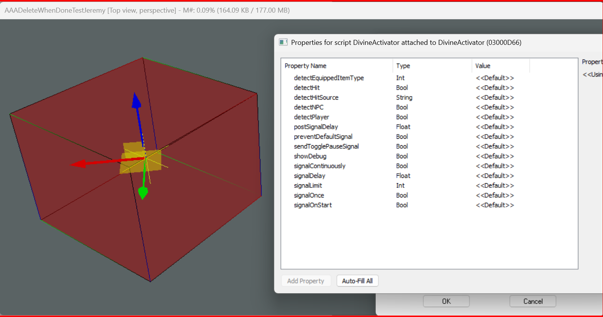

# Divine Logic - Documentation

## 📌 Index of Documentation
Below is a list of all documentation sections in the **Divine Logic** system:

1. [Trigger Box Documentation](#trigger-box-documentation)
2. [Trigger Box Marker Documentation](#trigger-box-marker-documentation)
3. [Core Scripts - ]

# Trigger Box Documentation

## 📌 Index of Trigger Boxes
Below is a list of all Trigger Boxes in the **Divine Logic** system:

1. [DivineActivator](#divineactivator)
2. [DivineActorModifier](#divineactormodifier)
3. [DivineAnimator](#divineanimator)
4. [DivineComparer](#divinecomparer)
5. [DivineContainerizer](#divinecontainerizer)
6. [DivineCutsceneCreator](#divinecutscenecreator)
8. [DivineDestroyer](#divinedestroyer)
9. [DivineEnabler](#divineenabler)
10. [DivineForcer](#divineforcer)
11. [DivineGlobalModifier](#divineglobalmodifier)
12. [DivineMessenger](#divinemessenger)
13. [DivineMixer](#divinemixer)
14. [DivinePlayerController](#divineplayercontroller)
15. [DivineScaler](#divinescaler)
16. [DivineSpawner](#divinespawner)
17. [DivineTranslator](#divinetranslator)
18. [DivineWarper](#divinewarper)

---

## 📦 **Trigger Box Documentation**

### **DivineActivator**
**Description:**  
> _DivineActivator is used to trigger actions when an object enters the box._  
> _It can be used to activate levers, open doors, or start events._

**🟢 Color:** _Green_

**📜 Script:** _DivineActivator.psc_

**⚙️ Properties:**
| Property Name | Type | Description |
|--------------|------|-------------|
| `ActivateOnEnter` | Boolean | Triggers activation when an entity enters. |
| `ActivateOnExit` | Boolean | Triggers activation when an entity exits. |
| `TargetRef` | Object Reference | The object that will be activated. |

**📷 Image Preview:**  

---

### **DivineActorModifier**
**Description:**  
> _Modifies actor attributes such as speed, health, or AI state when entering the trigger box._

**🟣 Color:** _Purple_

**📜 Script:** _DivineActorModifier.psc_

**⚙️ Properties:**
| Property Name | Type | Description |
|--------------|------|-------------|
| `ModifyHealth` | Boolean | Enables health modification. |
| `HealthMultiplier` | Float | Multiplier for the actor’s health. |
| `ModifySpeed` | Boolean | Enables speed modification. |
| `SpeedMultiplier` | Float | Multiplier for movement speed. |

**📷 Image Preview:**  

---